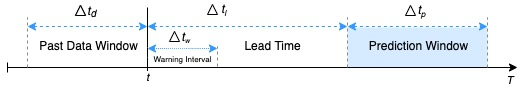

# Online Failure Prediction - Linux Failure Dataset

This repository contains failure datasets generated for the Linux OS using fault injection. Details on the process can be found in the paper **A Dataset of Linux Failure Data for Dependability Evaluation and Improvement** (currently under revision). The datasets are separated by workload: *cpu*, *matrix*, and *io* (currently only *cpu* dataset is available). A separate dataset was generated for each workload to also include the differential from the previous values.

**Do note**, these are preprocessed datasets, only a subset of experiments was considered:

- baseline runs
- failures that **met the following criteria**:
  - the fault activation was observed
  - the failure did not occur immediately after fault activation
  - the failure occurred within the workload execution time
  - the system metrics were consistently collected throughout the experiment

Each dataset is comprised of two files:
- *{...}.headers.txt* - this file contains the headers/features of the respective data contained in the *{...}.data.txt* file. Each entry in this file matches the respective feature on that file.
  - the *Description* feature contains the label of the experiment. If an experiment is a golden run (no faults were injected) its label starts with a 'G_' (e.g., *G_run-0-000-26_23_45*). If a failure occured, its label ends with an '-f' (e.g., *run-0-0438-17_4_25-f*). In the remaining experiments, faults were injected but no failure was observed

  - the *Index* feature references the relative instant within the experiment (e.g., *0* contains the first second/measurements, *1* the second, ...)

  - the *Fault* feature contains the fault id of the injected fault. Further details can be found on the raw dataset

  - the *netdata_{...}* features are the actual system metrics that were monitored throughout the experiments

  - the *label_{...}* features contain the label of each sample for a given *lead time* and *prediction window* (e.g., *label_20_40* contains the label for lead time 20 and prediction window 40)

- *{...}.data.txt* - this file contains the sequential monitoring of the various system metrics for the various experiments under a given workload. Each row is a given instant.

As depicted in the following image, the label of the samples in the dataset will be of failure if a failure occurs in the interval [t + Δtl, t + Δtl + Δtp]. Various failure modes were considered in this dataset:
  - *2*: Crash
  - *3*: CPU/Execution-related failures
  - *4*: Memory-related failures
  - *5*: Kernel-related failures
  - *7*: Hang-related failures  

  

The label may also assume the following values (for a given Δtl, Δtp), in which case the sample **must** be discarded:
  - 8 - when the experiment is too short for the chosen lead time (i.e., the TTF of the experiment is smaller than Δtl)
  - 9 - when the time to failure from that instant/sample is smaller than Δtl

The *fault_id* to *fault_type* mapping:

- 00: SWIFI_TEXT
- 01: INVALID-SWIFI_STACK
- 02: INVALID-SWIFI_HEAP
- 03: INVALID-SWIFI_DATA
- 04: INVALID-SWIFI_BSS
- 05: SWIFI_BRANCH
- 06: SWIFI_INVERSE
- 07: SWIFI_PTR
- 08: SWIFI_DSTSRC
- 09: SWIFI_INTERFACE
- 10: SWIFI_INIT
- 11: SWIFI_OFFBYONE
- 12: SWIFI_ALLOC
- 13: SWIFI_FREE
- 14: SWIFI_SIZE
- 15: SWIFI_BCOPY
- 16: SWIFI_LOOP
- 17: INVALID-SWIFI_IRQ
- 18: SWIFI_TEST_TEXT
- 19: SWIFI_TEST_STACK
- 20: SWIFI_TEST_HEAP
- 21: SWIFI_TEST_DATA
- 22: SWIFI_TEST_BSS
- 23: SWIFI_TEST_BRANCH
- 24: SWIFI_TEST_INVERSE
- 25: SWIFI_TEST_PTR
- 26: SWIFI_TEST_DSTSRC
- 27: SWIFI_TEST_INTERFACE
- 28: SWIFI_TEST_INIT
- 29: SWIFI_TEST_OFFBYONE
- 30: SWIFI_TEST_ALLOC
- 31: SWIFI_TEST_FREE
- 32: SWIFI_TEST_SIZE
- 33: SWIFI_TEST_BCOPY
- 34: SWIFI_TEST_LOOP
- 35: SWIFI_TEST_IRQ
- 36: SWIFI_VAR
- 37: SWIFI_NULL
- 38: SWIFI_NEWIRQ
- 39: SWIFI_TEST_VAR
- 40: SWIFI_TEST_NULL
- 41: SWIFI_TEST_NEWIRQ
